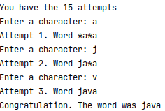

# The hangman

[](https://travis-ci.com/serveriev/hangman)

> The hangman game is written in java

## Install

### 1. Clean and package a jar file

```sh
 mvn clean package
```

### 2. Install a configuration dependency into *target/lib* folder
```sh
mvn install dependency:copy-dependencies -DincludeScope=runtime -DoutputDirectory=target/lib
```

## Tune the application

The application's setting is located in *resources/application.properties*. You can set words for guessing and max attempts.


## Run the application
```sh
java -classpath target/classes:target/lib/configuration-v1.1.jar io.lenur.hangman.Application
```

## Demo

